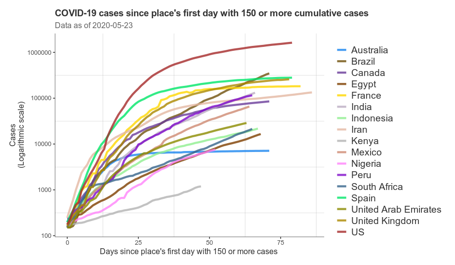

<!-- README.md is generated from README.Rmd. Please edit that file -->

``` r
## Load libraries
library(covid19)
library(ggplot2)
library(lubridate)
library(dplyr)
library(ggplot2)
library(sp)
library(raster)
library(viridis)
library(ggthemes)
library(sf)
library(rnaturalearth)
library(rnaturalearthdata)
library(RColorBrewer)
library(readr)
options(scipen = '999')
```

``` r
countries <- c('Kenya', 'South Africa', 'Nigeria', 'United Kingdom', 'France', 'Spain', 'US', 'Canada', 'Mexico', 'Peru', 'Brazil', 'India', 'Australia', 'Indonesia', 'Egypt', 'United Arab Emirates', 'Iran')

plot_day_zero(countries = countries,
              ylog = TRUE,
              day0 = 150,
              cumulative = TRUE)
```



``` r
ggsave('plot.pdf')
```
