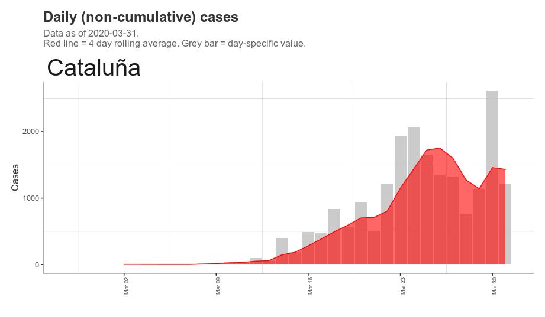
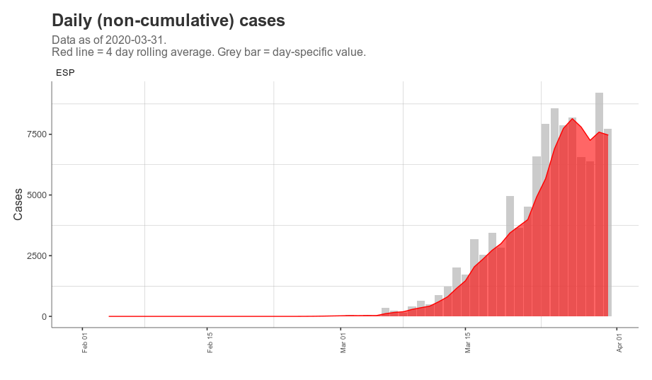
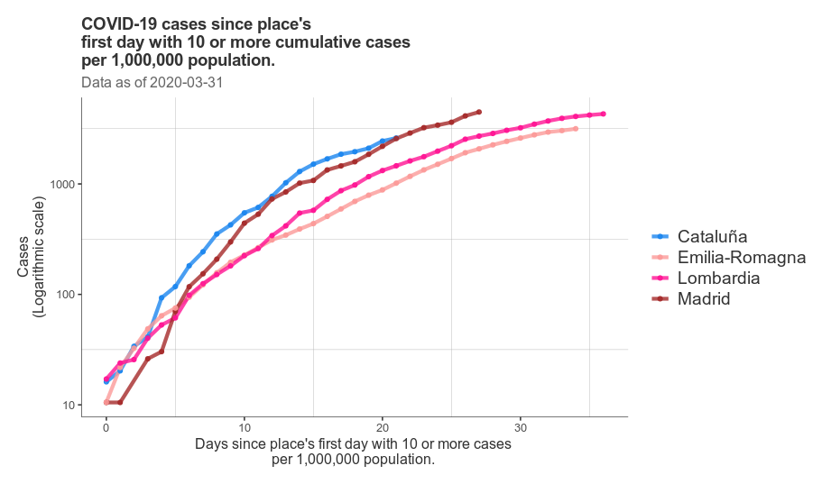
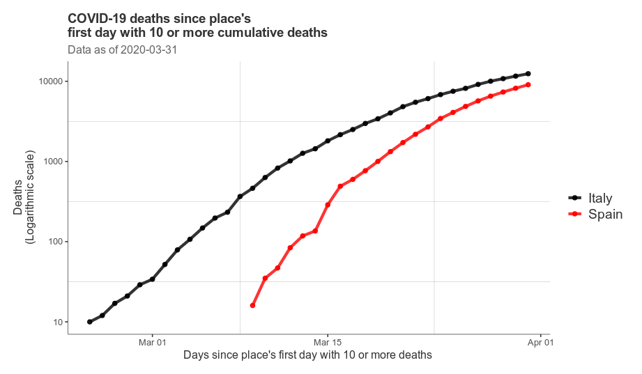
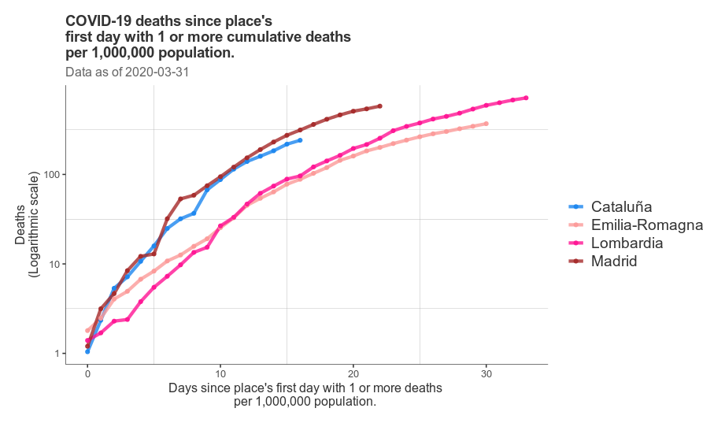
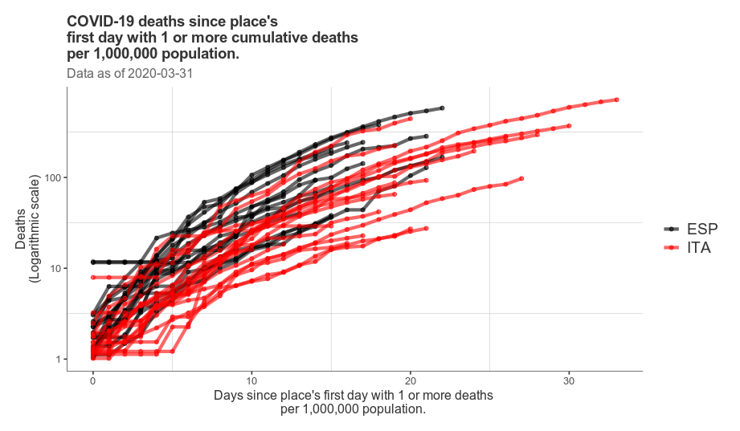

<!-- README.md is generated from README.Rmd. Please edit that file -->

## Catalunya, corbes epidèmiques

Corba epidèmica. CASOS. -Barras en gris: casos diaris -Vermell:
tendència (mitjana dels 4 dies anteriors)

Corba epidèmica. MORTS -Barras en gris: casos diaris -Vermell: tendència
(mitjana dels 4 dies anteriors)

## Espanya, corbes epidèmiques

Corba epidèmica. CASOS. -Barras en gris: casos diaris -Vermell:
tendència (mitjana dels 4 dies anteriors)

Corba epidèmica. MORTS -Barras en gris: casos diaris -Vermell: tendència
(mitjana dels 4 dies anteriors)

## CCAA, corbes epidèmiques

Corba epidèmica. CASOS. -Barras en gris: casos diaris -Vermell:
tendència (mitjana dels 4 dies anteriors)

Corba epidèmica. MORTS -Barras en gris: casos diaris -Vermell: tendència
(mitjana dels 4 dies anteriors)

## Comparacions amb Itàlia

Comparació Itàlia vs. Espanya, casos. Aix-X: data real

Comparació Itàlia vs. Espanya, casos. Aix-X: data relativa (des del
principi del brot)

Comparació Itàlia vs. Espanya, morts Aix-X: data real

Comparació Itàlia vs. Espanya, morts Aix-X: data relativa (des del
principi del brot)

Comparació Itàlia vs. Espanya, morts Aix-X: data relativa (des del
principi del brot), ajustat per població

Comparació Itàlia vs. Espanya, morts Aix-X: data relativa (des del
principi del brot), ajustat per població, morts diàries amb tendència
darrers 7 dies

Regions d’Itàlia vs Espanya. Madrid / Cat + Lombardia / ER. Ajustat per
població. CASOS.

Regions d’Itàlia vs Espanya. Madrid / Cat + Lombardia / ER. Ajustat per
població. MORTS

Regions d’Itàlia vs Espanya. Madrid / Cat + Lombardia / ER. Ajustat per
població. MORTS DIARIES

Regions d’Itàlia vs Espanya vs New York (USA). Morts per població

Regions d’Itàlia vs Espanya vs New York (USA). Morts sense ajustar per
població

Regions d’Itàlia vs Espanya

Madrid vs resta estat i Lombardia vs resta estat

## Map of portugal, france, spain

