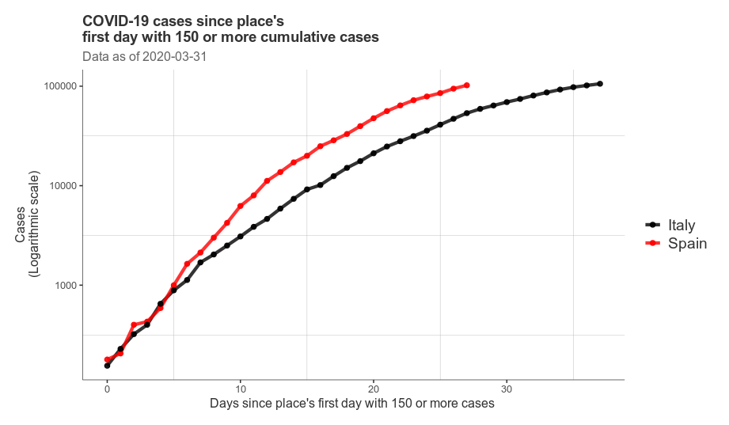

<!-- README.md is generated from README.Rmd. Please edit that file -->

## Catalunya, corba epidémica

Corba epidèmica. CASOS. -Barras en gris: casos diaris -Vermell:
tendència (mitjana dels 4 dies anteriors)

## Espanya, corba epidémica

Corba epidèmica. CASOS. -Barras en gris: casos diaris -Vermell:
tendència (mitjana dels 4 dies anteriors)

## Itàlia, corba epidémica

Corba epidèmica. CASOS. -Barras en gris: casos diaris -Vermell:
tendència (mitjana dels 4 dies anteriors)

# Magnitud del brot

Comparació Itàlia vs. Espanya, casos. Aix-X: data real

Comparació Itàlia vs. Espanya, casos. Aix-X: data relativa (des del
principi del brot)

Regions d’Itàlia vs Espanya. Madrid / Cat + Lombardia / ER. Ajustat per
població. CASOS.

Madrid vs resta estat i Lombardia vs resta estat

## Map of portugal, france, spain

